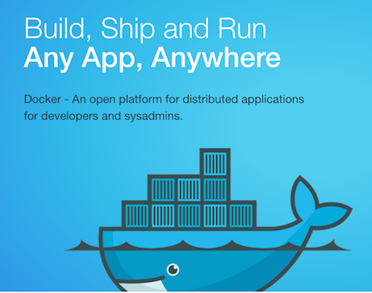
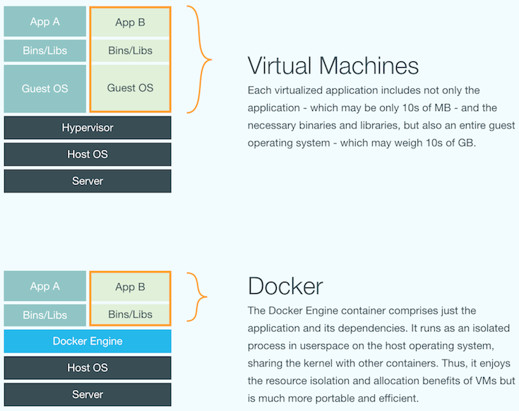
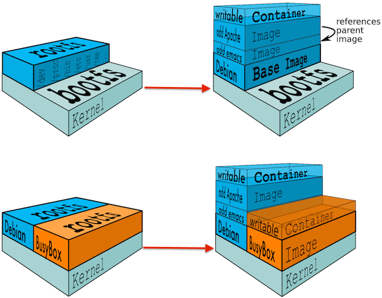

# Docker Introduction

**@WalmartLabs**
 
May 4th, 2015
 
Charles B Johnson

---

## Agenda

- What is Docker?

---

## What is Docker?

---
### What is Docker? (cont.)

#### Container virtualization tooling

- Docker Engine (github.com/docker/docker)
  - The core of the Docker projects
  - Originally a high level wrapper around lxc-containers (github.com/lxc/lxc)
  - Now using its own implementation (github.com/docker/libcontainer)

---

### What is Docker? (cont.)

#### Containers?

- Similar to `chroot`
- Virtual environment with its own resources (CPU, memory, storage, networking, etc.)
- "An environment as close as possible to a standard Linux installation but without the need for a separate kernel" (linuxcontainers.org/lxc/introduction/)
- Single kernel and host OS shared between containers

---

---

### What is Docker (cont.)

- Containers
  - `cgroups`
      - ie. so that a container cannot use all available CPU resources and starve other containers
  - Kernel namespaces
      - ie. so that processes in a container have no visibility into the processes in another container
- Docker
  - Images
      - Can be declaratively built with Dockerfiles
      - Layered through a Union File System (ie. AUFS)
      - Distributable through the Docker Registry
      - Versioned and tagged with metadata
  - Containers
      - Created from images
      - Run your actual application

---

### What is Docker (cont.)

---

## Agenda

- ~~What is Docker?~~
