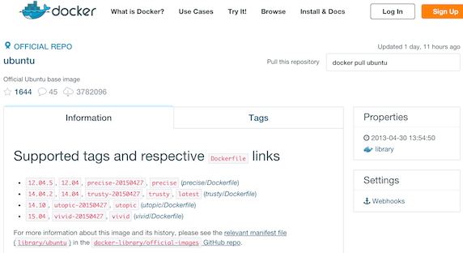
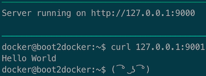
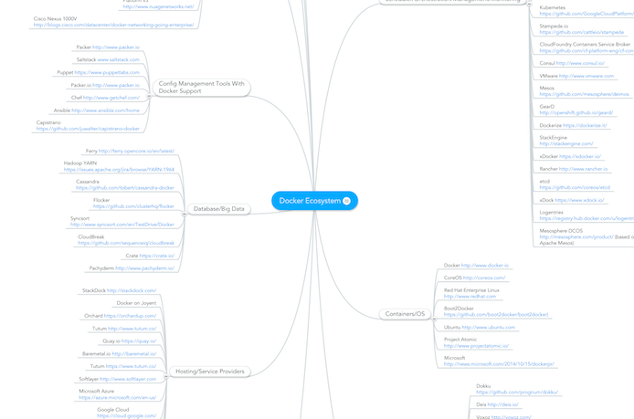

# Docker Introduction

**@WalmartLabs**
<br />
May 4th, 2015
<br />
Charles B Johnson

---

## Agenda

- *What is Docker?*
- How Do You Use Docker?
- The Past
- The Present
- The Future

---

## What is Docker?

.center[]

---
### What is Docker? (cont.)

#### Container virtualization tooling

- Docker Engine (github.com/docker/docker)
  - The core of the Docker projects
  - Originally a high level wrapper around lxc-containers (github.com/lxc/lxc)
  - Now using its own implementation (github.com/docker/libcontainer)

---

### What is Docker? (cont.)

#### Containers?

- Similar to `chroot`
- Virtual environment with its own resources (CPU, memory, storage, networking, etc.)
- "An environment as close as possible to a standard Linux installation but without the need for a separate kernel" (linuxcontainers.org/lxc/introduction/)
- Single kernel and host OS shared between containers

---

.center[]

---

### What is Docker (cont.)

- Containers
  - `cgroups`
      - ie. so that a container cannot use all available CPU resources and starve other containers
  - Kernel namespaces
      - ie. so that processes in a container have no visibility into the processes in another container
- Docker
  - Images
      - Can be declaratively built with Dockerfiles
      - Layered through a Union File System (ie. AUFS)
      - Distributable through the Docker Registry
      - Versioned and tagged with metadata
  - Containers
      - Created from images
      - Run your actual application

---

### What is Docker (cont.)

.center[]

---

## Agenda

- ~~What is Docker?~~
- *How Do You Use Docker?*
- The Past
- The Present
- The Future

---

## How Do You Use Docker?

#### Installation

- On OS X
  - Containers rely on capabilities that are only in the Linux kernel
  - Need to use a Linux VM to host Docker, Boot2Docker (github.com/boot2docker/boot2docker)
  is typically used
- On Linux
  - A kernel version 3.10+
  - Or 2.6.32-431 with backported kernel fixes
  - TL;DR Centos 6.5 can work with Docker, but 7+ is recommended

---

### How Do You Use Docker? (cont.)

#### In a nutshell

- Select a base image
- Add layers on top of that image to meet your application dependencies
- Run a container based on that image
  - Start your application

This can be done declaratively with a Dockerfile, or manually

---

### How Do You Use Docker? (cont.)

#### An io.js container in a nutshell, the manual way

- Select a base image
  - ubuntu:15.04

.center[]

---

### How Do You Use Docker? (cont.)

- Add layers on top of that image to meet your application dependencies
  - Create a layer that installs io.js and its dependencies

```bash
base_image="ubuntu:15.04"
iojs="https://iojs.org/dist/v1.8.1/iojs-v1.8.1-linux-x64.tar.gz"

script="
  apt-get update --assume-yes && apt-get install --assume-yes curl

  cd /usr/local
  curl --location \"$iojs\" \
    | tar --extract --gunzip --strip-components 1
"

container_id=$(docker run --detach $base_image bash -c "$script")
docker wait $container_id
image_id=$(docker commit $container_id)
```

---

### How Do You Use Docker? (cont.)

- Run a container based on that image
  - Start your application

```bash
app="
  let http = require('http');

  let server = http.createServer((request, response) => {
    response.end('Hello World\n');
  });

  server.listen(9000);
  console.log('Server running on http://127.0.0.1:9000');
"

docker run --publish 9001:9000 $image_id \
  iojs --use_strict --harmony_arrow_functions --eval "$app"
```

.center[]

---

## Agenda

- ~~What is Docker?~~
- ~~How Do You Use Docker?~~
- *The Past*
- The Present
- The Future

---

## The Past

#### Virtual Machines

- Must be explicitly requested
- Machines are designated as having specific purposes (ie. `dev`, `deploy`, `mongo`)
- Shared across the entire team
- Setup is familiar and generally well understood
- Very configurable
- "Fire and forget"

---

### The Past (cont.)

#### Virtual Machines

- Who is responsible for maintaining these machines?
- How do we manage multiple applications requiring different versions of the same dependency?
- How do we know what has changed?
- What happens when something breaks?

---

### The Past (cont.)

#### Virtual Machines

.center[]

---

## Agenda

- ~~What is Docker?~~
- ~~How Do You Use Docker?~~
- ~~The Past~~
- *The Present*
- The Future

---

## The Present

#### OneOps

- Gives us a powerful abstraction over OpenStack
- Maintenance is greatly simplified
- Configuration is visual and easy to understand
- Our applications are isolated from other applications
- Dependencies and setup are automatically handled
- Has its own form of version control built into the interface
- Supports basic monitoring
- Allows for staged deployments
- Supports multiple environments for no extra effort

---

### The Present (cont.)

#### OneOps

- UI is cumbersome
- Difficult to iterate and experiment since the feedback loop is slow and often error prone
- How do you accomplish development (on a developer's machine) vs production parity?
- Configuration is limited
- Mostly proprietary

---

## Agenda

- ~~What is Docker?~~
- ~~How Do You Use Docker?~~
- ~~The Past~~
- ~~The Present~~
- *The Future*

---

## The Future

#### Docker

- Includes almost all the benefits of OneOps
- Development and production environments are identical
  - Application and the environment are created in development
- The packaged application is self-contained
  - Easy to setup in production or on a new engineer's machine
- Setting up images is familiar, automated, repeatable, and faster to iterate on
- Containers are not limited to the OS of the host
  - Choose your own software and its own versions
- Images can be shared across teams
  - Not solely dependent on OneOps developers to create specific configurations
- Infrastructure as code, Dockerfiles can just be checked into GitHub
- Less resource intensive than VMs, but also better performance
- Open Source

---

### The Future (cont.)

#### Beyond?

- The tooling is growing at an accelerating rate
  - Container optimized distros
      - CoreOS, RancherOS, Ubuntu Snappy, Project Atomic, Photon
  - Clustering
      - Docker Swarm, Kubernetes, Mesos
  - Orchestration
      - Docker Compose
  - Service Discovery & Networking
      - Weave
  - Portability
      - Flocker
- It doesn't end at Docker
  - rkt, LXD

---

### The Future (cont.)

#### Wtf

.center[]

---

## Agenda

- ~~What is Docker?~~
- ~~How Do You Use Docker?~~
- ~~The Past~~
- ~~The Present~~
- ~~The Future~~

---

## The End

<video poster="//i.imgur.com/FKRMMaph.jpg" preload="auto" autoplay="autoplay" muted="muted" loop="loop">
  <source src="//i.imgur.com/FKRMMap.webm" type="video/webm">
  <source src="//i.imgur.com/FKRMMap.mp4" type="video/mp4">
</video>

THANKS
